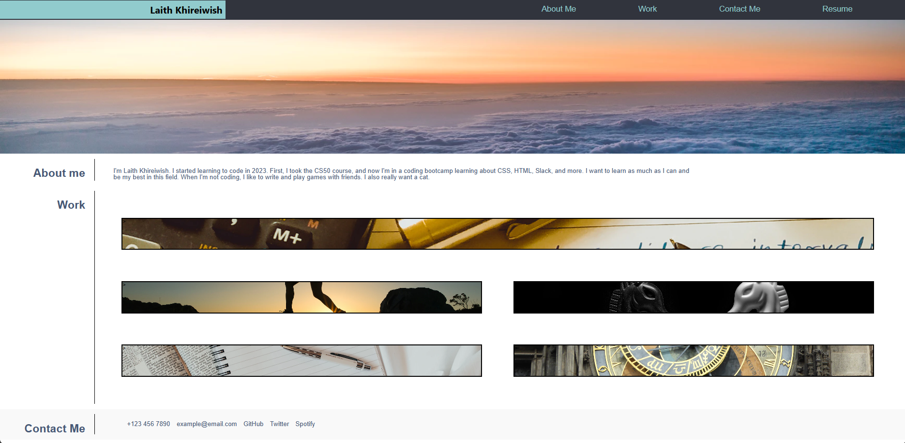

# portfolio

## Description:
In this sample portfolio, I’ve created a header that includes a name and a banner that encompasses an image. There's also a section listing various works, featuring a fading effect upon mouse hover, and a 'Contact Me' section. This portfolio is a representation of my grasp on HTML and CSS concepts learned recently. The last module was quite enlightening, introducing me to a plethora of concepts. The main aim here is to demonstrate the practical application of these newly acquired skills and concepts, providing a clear and concise showcase of my learning.

[Link to website](https://vincula1.github.io/portfolio/)